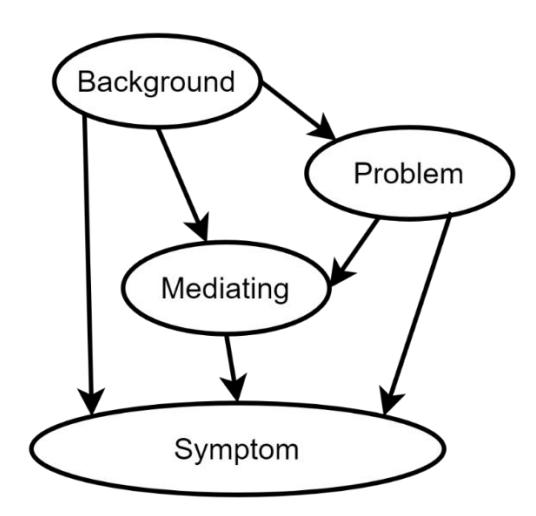

===================
BAHAMAS Calculation
===================

Bayesian Belief Network (BBN)
-----------------------------

Bayesian networks consist of variables, also called nodes, that
represent events of interest for a given domain and are classified as
problem variables, information variables, and mediating variables :cite:`Kjaerulff2013BayesianNetworks`.
:numref:`bbn_general` provides a generalized structure of a
Bayesian network, with the variable types clearly labeled. The details on
these variables are as follows:

- **Problem variables** (sometimes called hypothesis variables) are
  variables that typically cannot be measured or observed directly.

- **Information variables** are variables that can be observed, measured, etc.
  Information variables include:

  - **Background variables**, which provide information or prior knowledge
    pertaining to the problem.
  - **Symptom variables**, which provide information that serves as a type of
    evidence of the problem variable.

- **Mediating variables** are variables that, though not directly observed,
  are useful for building the BBN. They are often used through a
  process called “divorcing,” a modeling technique that reduces
  the burden of assessing the conditional probability between parent and
  child nodes :cite:`Kjaerulff2013BayesianNetworks`.

.. _bbn_general:

  Generalized Bayesian Network with Labeled Node Types

Bayesian Belief Network for BAHAMAS
-----------------------------------

For BAHAMAS, software failure is a “problem
variable”. A primary motivation of
the present work is to estimate software failure from limited data. Data
observed through testing fulfill the role of a symptom variable; without
data, estimating or predicting software failure becomes a task for a
reduced network. For BAHAMAS, the network is reduced to only the
background and problem nodes. Intermediate or mediating nodes are
employed to help evaluate software failure probabilities. Reducing the
network for limited data also alters the type of calculations needed. If
there are no symptoms, no observations will be made, and the network
will remain at a level reliant on prediction-type calculations to
estimate software failure probabilities.

Software failure probabilities are determined by evaluating the BBN, which involves
calculating the marginal probability of a child node given the state of
its parents. The marginal probability represents the probability of a
specific state within the joint probability of all other states.
This calculation proceeds in the direction of the arrows shown in
:numref:`bahamas_structure` and is repeated until the final node's
marginal probability is determined.

:eq:`bbn-1` shows the marginal probability of a specific state `i` of a child node
(i.e., `c`) with two parents (i.e., `a`, `b`), within a BBN. The parents have
`n` and `m` total states.

.. _eq-bbn1:

.. math::
  :label: bbn-1

  P(c_i) = \sum_{j=1}^{n} \sum_{k=1}^{m} P(c_i|a_j, b_k) P(a_j) P(b_k)

The conditional probability of a child state, given the state of its
parents, changes depending on which of the nodes shown in :numref:`bahamas_structure` are
being assessed.

The main calculation proceeds by applying :eq:`bbn-1` to determine
the specific software defect types for each stage (i.e., the purple nodes
shown in :numref:`bahamas_structure`). :math:`Type_{ij}` is defect type (i) remaining
from stage (j). The probability of a specific defect type remaining for
a particular stage is given by the following equation, where `a` represents
human errors, `b` represents review, and `c` represents a specific defect
type for a given stage. Each has two states (i.e., `1 = yes`; `2 = no`). The
expansion of the equation is as follows:

.. _eq-bbn2:

.. math::
  :label: bbn-2

  P(c_i) = P(c_i|a_1,b_1)P(a_1)P(b_1) + P(c_i|a_2,b_1)P(a_2)P(b_1) + P(c_i|a_1,b_2)P(a_1)P(b_2) + P(c_i|a_2,b_2)P(a_2)P(b_2)

This expansion can be reduced. The conditional probability of a specific
defect remaining is zero when there are no human errors for a given
stage. Thus, :math:`P(c_i|a_2,b_k)=0` when :math:`P(a_2)\geq 0` .

.. _eq-bbn3:

.. math::
  P(c_i) = P(c_i|a_1,b_1)P(a_1)P(b_1) + P(c_i|a_1,b_2)P(a_1)P(b_2)

Further reduction is achieved by recognizing that review either occurs
or does not occur, with a probability of zero or one (i.e., if
:math:`P(b_1) = 1` , then :math:`P(b_1) = 0` ). If review is performed,
then :math:`P(b_1) = 1` and :math:`P(b_2) = 0`, and the equation reduces
to:

.. _eq-bbn4:

.. math::
  P(c_i) = P(c_i|a_1, b_1)P(a_1)

If no review is performed, then :math:`P(b_1) = 0` and
:math:`P(b_2) = 1`, and the equation reduces to:

.. _eq-bbn5:

.. math::
  P(c_i) = P(c_i|a_1, b_2)P(a_1)

Thus, the probability of a specific defect type remaining for a
particular stage of the SDLC is given by :eq:`bbn-2`, which is a
reduced form of the marginal probability, where :math:`P(D_j)` is the
probability of defects introduced (i.e., human error, as given by Equation
(1)).

.. _eq-bbn6:

.. math::
  P(Type_{ij} = True) = P(Type_{ij}|D_j, R_j)P(D_j)

where :math:`P(Type_{ij}|D_j,R_j)` is the conditional probability of a
specific defect type, given the human errors and review activities. It
is determined via the defect conditional probability equation, as follows:

.. _eq-bbn7:

.. math::
  DCP = \begin{cases} StageReview(all\ states)\ and\ StageDefect\ (yes), & DCP = Ge^{-4TCR} \\ StageReview(all\ states)\ and\ StageDefect(no), & DCP = 0 \end{cases}

where `G` is the general expected probability of a defect type for a given SDLC
stage, `TC` is the stage-level trigger coverage, and `R` is the
average number of reviews performed for each task of the SDLC stage.

Next, the marginal probability equation is likewise employed for the
yellow-colored node in :numref:`bahamas_structure`. This determines each defect
:math:`Type_i` remaining after all six SDLC stages (i.e., a, b, c, d, e, f).
The conditional probability
:math:`P(Type_i|a_k,b_l,c_m,d_n,e_p,f_q)=1` when the probability that the
stage's defect types existing exceeds zero, :math:`P(Type_{ij})>0` ,
otherwise, :math:`P(Type_i|a_k,b_l,c_m,d_n,e_p,f_q)=0`.

.. _eq-bbn8:

.. math::
  P(Type_{j} = True)
  = \sum_{k=1}^{2} \sum_{l=1}^{2} \sum_{m=1}^{2} \sum_{n=1}^{2} \sum_{p=1}^{2} \sum_{q=1}^{2} P(G_{j} | a_{k}, b_{l}, c_{m}, d_{n}, e_{p}, f_{q}) P(a_{k}) P(b_{l}) P(c_{m}) P(d_{n}) P(e_{p}) P(f_{q})

Finally, the software failure probability is given by the following equation, where
`I` is the total number of defect types considered
by BAHAMAS, and :math:`UCA_x` represents the failure modes evaluated:

.. _eq-bbn9:

.. math::
  P(UCA_x) = \sum_{i=1}^{I} P(UCA_x | Type_i) P(Type_i)

An inherent assumption in this work is that software failure results from active defects.
An implication of above equation is that defect activation probability equals one and that the
activation of defects is mutually exclusive (i.e., multiple defects are not activated simultaneously).
In other words, the probability of software failure is a summation of the contribution of each defect type.
Future work may investigate refinements to this activation probability.
