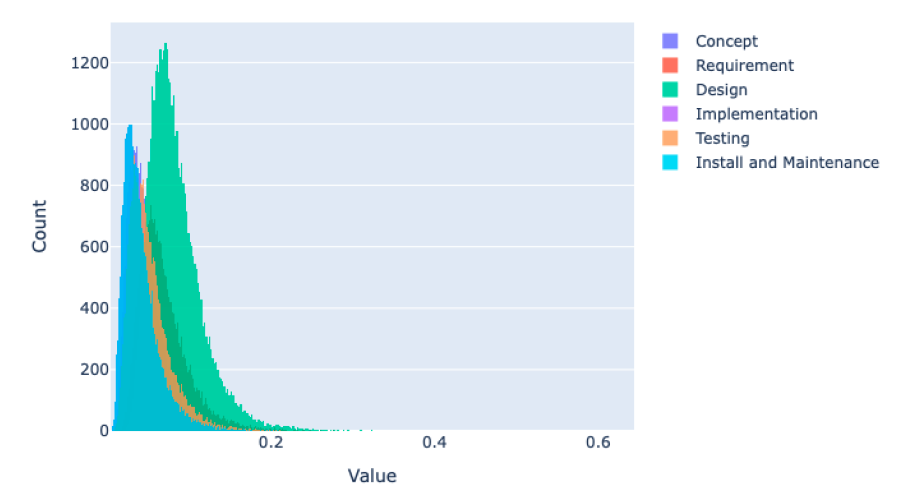
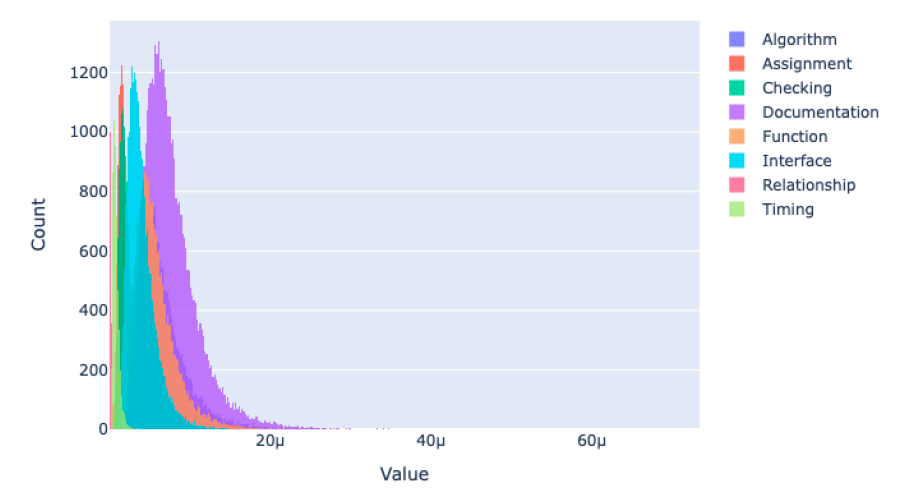
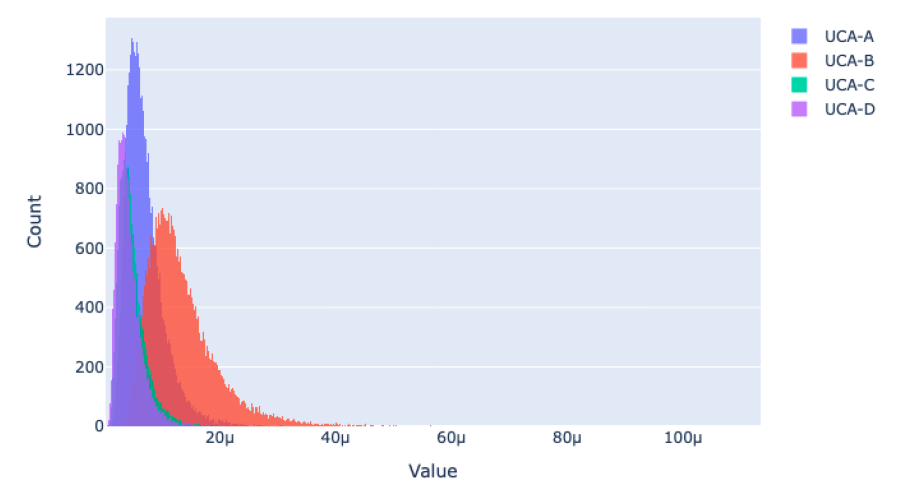
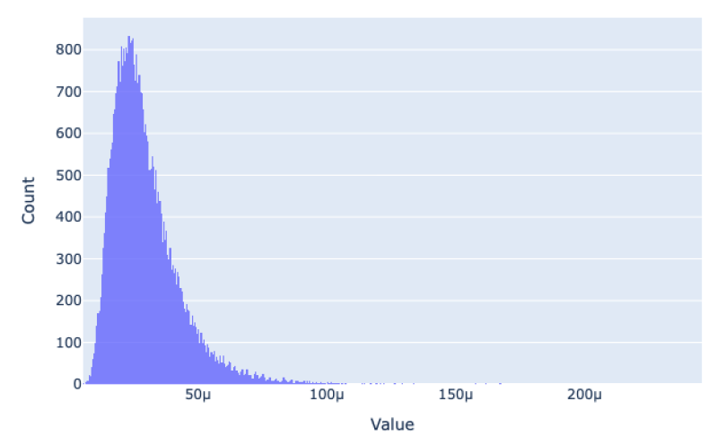

=======
Example
=======

Example: Software Failure Probability Evaluation
------------------------------------------------

Run
+++

.. code:: bash

  conda activate bahamas_libs
  cd /path/to/BAHAMAS/examples
  python ../bahamas/main.py -i bbn.toml

BAHAMAS Input
+++++++++++++

.. code:: toml

  [BBN]
  [BBN.params]
  samples = 40000
  seed = 2

  [BBN.files]
  task = "../data/Task_List.xlsx"
  defect = "../data/Defect_Data.xlsx"
  approx = "../data/sdlc_macro.xlsx"

  [BBN.analysis]
  type = 'precise'

Screen Output
+++++++++++++

.. code:: bash

  06-Aug-25 09:39:54 BAHAMAS              INFO     Welcome!
  06-Aug-25 09:39:54 BAHAMAS              INFO     Input file: ../data/Task_List.xlsx
  06-Aug-25 09:39:54 BAHAMAS              WARNING  Default output file ../data/out_Task_List.xlsx will be used
  06-Aug-25 09:39:54 BAHAMAS.ODC          INFO     Construct ODC Conditional Distribution for each SDLC stage
  06-Aug-25 09:39:54 BAHAMAS.UCA          INFO     Construct UCA ODC defect correlation distribution.
  06-Aug-25 09:39:54 BAHAMAS.BBN          INFO     Sampling HEP and DCP
  06-Aug-25 09:39:54 BAHAMAS.HEP          INFO     Calculate SDLC "Concept" stage HEP
  06-Aug-25 09:39:54 BAHAMAS.DCP          INFO     Calculate DCP for SDLC "Concept" stage
  06-Aug-25 09:39:54 BAHAMAS.HEP          INFO     Calculate SDLC "Requirement" stage HEP
  06-Aug-25 09:39:54 BAHAMAS.DCP          INFO     Calculate DCP for SDLC "Requirement" stage
  06-Aug-25 09:39:54 BAHAMAS.HEP          INFO     Calculate SDLC "Design" stage HEP
  06-Aug-25 09:39:54 BAHAMAS.DCP          INFO     Calculate DCP for SDLC "Design" stage
  06-Aug-25 09:39:54 BAHAMAS.HEP          INFO     Calculate SDLC "Implementation" stage HEP
  06-Aug-25 09:39:54 BAHAMAS.DCP          INFO     Calculate DCP for SDLC "Implementation" stage
  06-Aug-25 09:39:54 BAHAMAS.HEP          INFO     Calculate SDLC "Testing" stage HEP
  06-Aug-25 09:39:54 BAHAMAS.DCP          INFO     Calculate DCP for SDLC "Testing" stage
  06-Aug-25 09:39:54 BAHAMAS.HEP          INFO     Calculate SDLC "Install and Maintenance" stage HEP
  06-Aug-25 09:39:54 BAHAMAS.DCP          INFO     Calculate DCP for SDLC "Install and Maintenance" stage
  06-Aug-25 09:39:54 BAHAMAS.BBN          INFO     Sampling ODC
  06-Aug-25 09:39:54 BAHAMAS.BBN          INFO     Sampling UCA
  06-Aug-25 09:39:54 BAHAMAS.BBN          INFO     Compute marginal ODC
  06-Aug-25 09:39:54 BAHAMAS.BBN          INFO     BBN Propagation
  06-Aug-25 09:39:54 BAHAMAS.BBN          INFO     Compute UCA and total failure probabilities
  06-Aug-25 09:39:56 BAHAMAS              INFO     Software total failure: 2.9825182468709206e-05 with std 1.4002568043296736e-05
  06-Aug-25 09:39:56 BAHAMAS              INFO     UCA type: UCA-A, Mean: 7.127925281781246e-06, STD: 3.4908455837352817e-06
  06-Aug-25 09:39:56 BAHAMAS              INFO     UCA type: UCA-B, Mean: 1.3451519498232246e-05, STD: 6.3548059571775254e-06
  06-Aug-25 09:39:56 BAHAMAS              INFO     UCA type: UCA-C, Mean: 4.900300523766049e-06, STD: 2.4943170792606996e-06
  06-Aug-25 09:39:56 BAHAMAS              INFO     UCA type: UCA-D, Mean: 4.345437164929662e-06, STD: 2.336590212125128e-06
  06-Aug-25 09:39:56 BAHAMAS              INFO      ... Complete!

Plots
+++++

.. _hep_stage:

  SDLC Stage Failure Probabilities Based on Human Error Propagation

.. _odc_sfp:

  Software Orthogonal Defect Classification Failure Probabilities

.. _uca_sfp:

  Software Unsafe Control Action Failure Probabilities

.. _total_sfp:

  Total Software Failure Probability

Example: Common Cause Component Group Generation
------------------------------------------------

Run
+++

.. code:: bash

  conda activate bahamas_libs
  cd /path/to/BAHAMAS/examples
  python ../bahamas/main.py -i ccf.toml

BAHAMAS Input
+++++++++++++

.. code:: toml

  [CCF]

  [CCF.files]
  structure= "../data/Scenario_6.csv"

  [CCF.generate]
  output_file_base = "s6_cccg"
  output_type = "csv"
  final = true
  single = true
  double = true
  triple = true

Screen Output
+++++++++++++

.. code:: bash

  22-Oct-25 11:19:44 BAHAMAS              INFO     Welcome to use BAHAMAS!
  22-Oct-25 11:19:44 BAHAMAS.Workflow     INFO     Initialization
  22-Oct-25 11:19:44 BAHAMAS.validate     INFO     TOML input file is valid.
  22-Oct-25 11:19:44 BAHAMAS.Workflow     INFO     Start CCCGs generation
  22-Oct-25 11:19:44 BAHAMAS.CCCG         INFO     Generating
  22-Oct-25 11:19:45 BAHAMAS.CCCG         INFO     Save CCCGs into s6_cccg_final.csv
  22-Oct-25 11:19:45 BAHAMAS.CCCG         INFO     Save CCCGs into s6_cccg_single.csv
  22-Oct-25 11:19:45 BAHAMAS.CCCG         INFO     Save CCCGs into s6_cccg_double.csv
  22-Oct-25 11:19:45 BAHAMAS.CCCG         INFO     Save CCCGs into s6_cccg_triple.csv
  22-Oct-25 11:19:45 BAHAMAS.Workflow     INFO     End CCCGs generation
  22-Oct-25 11:19:45 BAHAMAS              INFO      ... Complete!

