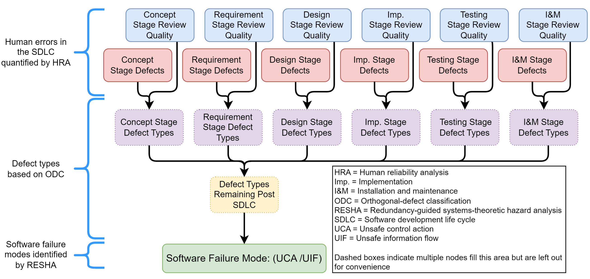
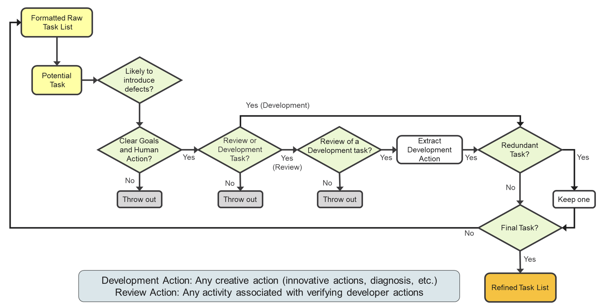
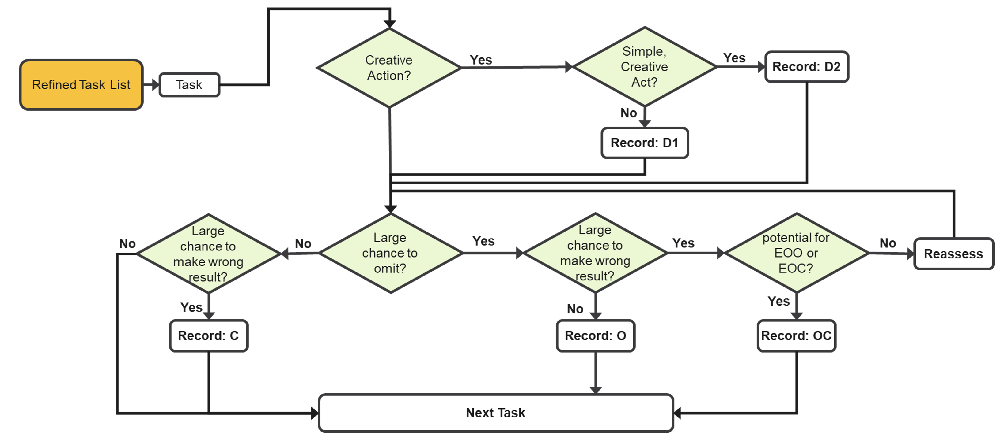

============
Introduction
============

What Is BAHAMAS?
----------------

BAHAMAS is a risk assessment tool developed under the Light Water Reactor Sustainability (LWRS) program.
It was developed for cases in which limited testing or operational data are available, such as for reliability
estimations of software in early development stages  :cite:`Bao2023RiskAssessment`. BAHAMAS was created based on the notion that software failure
occurs when a latent defect is activated via use or operation of the software. Defects (e.g., coding errors,
installation errors, maintenance errors, setpoint changes, and requirements errors) may be introduced into the software
code via human error at any stage of the software development life cycle (SDLC), and are activated by
certain operational conditions :cite:`Muhlheim2016SoftwareCCF`. BAHAMAS combines these factors into a network that traces software failures to
their root human causes. Instead of relying on testing data, BAHAMAS employs a Bayesian belief network (BBN) to map the
causes of software failures to specific defect types. :numref:`bahamas_structure` shows the general concepts employed within BAHAMAS,
as well as the general structure of the BBN.

.. _bahamas_structure:

  General Structure of BAHAMAS

BAHAMAS evaluates software failures by tracking defect introduction and defect removal activities, their impact on the
types of defects that may remain within software, and ultimately the probability of software failure.
The BAHAMAS BBN consists of the following nodes:

*	Red nodes: Account for the introduction of defects by considering human errors at each stage of the SDLC.
*	Blue nodes: Account for the defect removal activities employed during the SDLC.
*	Purple nodes: Account for the types of defects that remain in the software at any given stage of the SDLC.
*	Yellow node: Accounts for the types of defects that remain in the software after all stages of the SDLC.
*	Green node: Accounts for the software failure probability, based on the defects that remain in the software after the SDLC.

In total, BAHAMAS employs the following concepts. When accounting for defect introduction and removal, specific types
of defects will remain in the software. Depending on the types of defects that remain, the software will exhibit
certain failure modes. The following sections detail each of these concepts and how they are accounted for by BAHAMAS.

Identify the Software Development Tasks
---------------------------------------

SDLC activities and their tasks are clarified by the standards, manuals, programs, plans, and policies followed by
developers. The SDLC tasks should be identified and then mapped to the stages to which they most directly correspond within
the BAHAMAS network. The stages selected for BAHAMAS are the concept, design, requirement, implementation, testing, and installation
& maintenance stages. Even though standards and guidelines may show consistency regarding when a given task is performed, the
specifics can vary. :numref:`task_identification` shows a flowchart that assists in SDLC task identification.

.. _task_identification:

  Flowchart for Assisting in SDLC Task Identification

Determine Human Error Probabilities for Identified Tasks
--------------------------------------------------------

The SDLC tasks identified in the previous step are to be evaluated for human errors. :numref:`task_hep` provides general
guidance for assigning a mode to each SDLC task. For each given task, the flowchart provides some combination of
diagnosis error (D1), simple diagnosis error (D2), commission error (C), omission error (O) and
omission and commission error (OC).

.. _task_hep:

  Process for Human Error Probability Determination
